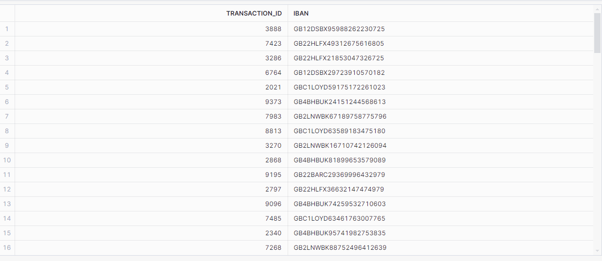

# Preppn-Challenge-2023-Week-2

Solving Tableau Prep Challenge 2023 Week 2 using SQL/Snowflake

**TASK**

2023 Week 2 - Data Source Bank has a requirement to construct International Bank Account Numbers (IBANs), even for Transactions taking place in the UK. We have all the information in separate fields, we just need to put it altogether.

- Remove the dashes from the Sort Code field in the Transaction Table.
- Use the SWIFT Bank code lookup table to bring in additional information.
- Add a field for the Country Code.
- Create the IBAN and remove unnecessary fields.

**SQL/Snowflake Techniques Used**

1.  Removing substrings with REPLACE()
2.  Multi-table queries with Joins

## Solution

### 1. Removing the dashes

REPLACE function was used to remove the dashes in Sort Code field.

```
    SELECT REPLACE(SORT_CODE, '-', '')as SORT_CODE, *
        FROM PD2023_WK02_TRANSACTIONS;
        ;
```

### 2. Joining the Lookup Table, adding Country code column and creating IBAN column

Did an Inner Join on the two tables on Bank column.

```
    SELECT REPLACE(SORT_CODE, '-', '')as SORT_CODE, *, 'GB' as Country_Code,
            'GB' || check_digits || swift_code || REPLACE(SORT_CODE, '-', '') || account_number as IBAN
                    FROM PD2023_WK02_TRANSACTIONS
                        INNER JOIN PD2023_WK02_SWIFT_CODES
                                ON PD2023_WK02_TRANSACTIONS.BANK = PD2023_WK02_SWIFT_CODES.BANK
                    ;
```

### 3. Removing the unnecessary columns

Instead of bringing in all the columns (\*), just bring in the required columns.

```
    SELECT TRANSACTION_ID,
            'GB' || check_digits || swift_code || REPLACE(SORT_CODE, '-', '') || account_number as IBAN
                    FROM PD2023_WK02_TRANSACTIONS
                        INNER JOIN PD2023_WK02_SWIFT_CODES
                                ON PD2023_WK02_TRANSACTIONS.BANK = PD2023_WK02_SWIFT_CODES.BANK
                    ;
```

The output:


